# 一、人机交互

## 1、什么是cmd？

就是在 Windows 操作系统中，利用命令行的方式去操作计算机。

我们可以利用 cmd 命令去操作计算机，比如：打开文件，打开文件夹，创建文件夹等。

## 2、如何打开CMD窗口

1. 按下快捷键：win + R。

		此时会出现运行窗口。

2. 在运行窗口中输入 cmd
3. 回车

> cmd 默认操作 C 盘下的 Users 文件夹下的 XXX 文件夹。（XXX 就是你的用户名）

 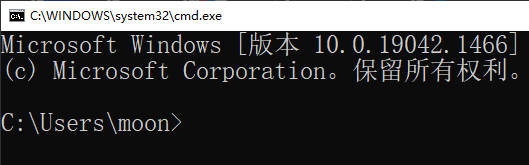

## 3、常用 CMD 命令

 扩展一个小点：

* 在很多资料中都说成是 DOS 命令，其实是不对的。真正的 DOS 命令是 1981 年微软和 IBM 出品的 MS-DOS 操作系统中的命令才叫做 DOS 命令。

* 而在 Windows 中，win98 之前的操作系统是以非图形化的 DOS 为基础的，可以叫做 DOS 命令。到了 2000 年以后，windows 逐渐以图形化界面为主了，这个时候就不能叫 DOS 命令了，他只是模拟了 DOS 环境而已，很多原本的 DOS 命令已经无法使用了，所以这个时候叫做 CMD 命令会更准确一些。

常见的 CMD 命令如下：

| 操作               | 说明                                    |
| ------------------ | --------------------------------------- |
| 盘符名称:          | 盘符切换。如 E: 回车，表示切换到 E 盘。 |
| dir                | 查看当前路径下的内容。                  |
| cd 目录            | 进入单级目录。如 cd itheima             |
| cd ..              | 回退到上一级目录。                      |
| cd 目录1\目录2\... | 进入多级目录。如 cd itheima\JavaSE      |
| cd \               | 回退到盘符目录。                        |
| cls                | 清屏。                                  |
| exit               | 退出命令提示符窗口。                    |

## 4、CMD 练习

需求：利用 cmd 命令打开自己电脑上的 QQ。

完成步骤：

1. 确定自己电脑上的 QQ 安装在哪里
2. 启动 cmd
3. 进入到启动程序 QQ.exe 所在的路径。
4. 输出 qq.exe 加回车表示启动 qq。

> 在 windows 操作系统当中，文件名或者文件夹名是忽略大小写的

## 5、环境变量

作用：

如果我想要在 CMD 的任意目录下，都可以启动某一个软件，那么就可以把这个软件的路径配置到环境变量中的 PATH 里面。

> 在启动软件的时候，操作系统会先在当前路径下找，如果在当前目录没有再到环境变量的路径中去找。如果都找不到就提示无法启动。

步骤：

- 右键我的电脑，选择属性。
- 点击左侧的高级系统设置
- 选择高级，再点击下面的环境变量。
- 找系统变量里面的 PATH
- 把软件的完整路径，配置到 PATH 当中就可以了。
- （可做可不做）把自己配置的路径，移动到最上面。

图解示例如下：

第一步：右键点击我的电脑并选择属性。

（如果无法出现第二步界面，可以打开我的电脑之后右键点击空白处）


第二步：点击高级系统设置。

​	 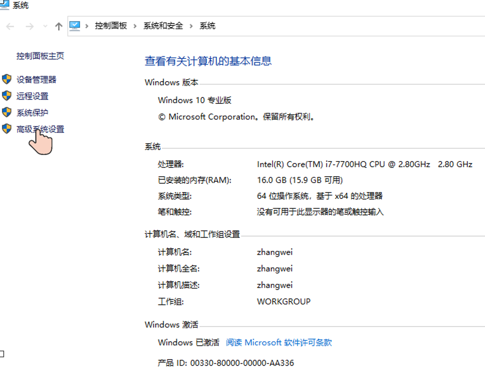

第三步：选择高级，再点击下面的环境变量。

 

第四步：找系统变量里面的 PATH

 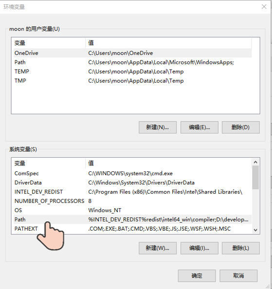

第五步：点击新建，把软件的完整路径，配置到 PATH 当中，再点击确定即可。

第六步：（可做可不做）点击上移，把当前配置的路径移动到最上面。

移动的好处：在 CMD 中打开软件时，会先找当前路径，再找环境变量，在环境变量中是从上往下依次查找的，如果路径放在最上面查找的速度比较快。

 

# 二、Java 概述

## 1、Java 是什么？

语言：人与人交流沟通的表达方式

计算机语言：人与计算机之间进行信息交流沟通的一种特殊语言

Java 是一门非常火的计算机语言（也叫做编程语言）

我们想要让计算机做一些事情，那么就可以通过 Java 语言告诉计算机就可以了

## 2、下载和安装

### 2.1、下载

通过官方网站获取 JDK：[http://www.oracle.com](http://www.oracle.com/)

**注意 1**：针对不同的操作系统，需要下载对应版本的JDK。

**注意 2**：

如果你的电脑是 Windows32 位的，建议重装系统，重装成 64 位的操作系统。

因为 Java 从 9 版本开始，就已经不提供 32 位版本的安装包了。

### 2.2、安装

傻瓜式安装，下一步即可。默认的安装路径是在 `C:\Program Files` 下。

建议：

- 安装路径不要有中文，不要有空格等一些特殊的符号。
- 以后跟开发相关的所有软件建议都安装在同一个文件夹中，方便管理。

### 2.3、JDK的安装目录介绍

| 目录名称 | 说明                                                         |
| -------- | ------------------------------------------------------------ |
| bin      | 该路径下存放了 JDK 的各种工具命令。javac 和 java 就放在这个目录。 |
| conf     | 该路径下存放了 JDK 的相关配置文件。                          |
| include  | 该路径下存放了一些平台特定的头文件。                         |
| jmods    | 该路径下存放了 JDK 的各种模块。                              |
| legal    | 该路径下存放了 JDK 各模块的授权文档。                        |
| lib      | 该路径下存放了 JDK 工具的一些补充 JAR 包。                   |

## 3、HelloWorld小案例

HelloWorld 案例是指在计算机屏幕上输出 “HelloWorld” 这行文字。各种计算机语言都习惯使用该案例作为第一个演示案例。

### 3.1、Java 程序开发运行流程

开发 Java 程序，需要三个步骤：编写程序，编译程序，运行程序。

### 3.2、HelloWorld 案例的编写

1. 新建文本文档文件，修改名称为 HelloWorld.java。
   * **注意**：后缀名为 java 的才是 java 文件。

2. 用记事本打开 HelloWorld.java 文件，输写程序内容。

```java
public class HelloWorld {
	public static void main(String[] args) {
		System.out.println("HelloWorld");
	}
}
```

3. 保存
   * **注意**：未保存的文件在左上角会有 * 符号标记

4. 编译文件。编译后会产生一个 class 文件。

   * java 文件：程序员自己编写的代码。
   * class 文件：交给计算机执行的文件。
   
5. 运行代码

   * **注意**：运行的是编译之后的 class 文件。

> 编译的动作其实就是翻译，把操作系统看不懂的内容变成操作系统能看懂的内容
>
> 整个过程用到两个命令：
>
> * javac + 文件名 + 后缀名 （就是编译 java 文件）
>
> * java + 文件名（运行编译之后的 class 文件）
>
> tips：有 c 有后缀，无 c 无后缀

## 4、HelloWorld 案例常见问题

### 4.1、BUG

在电脑系统或程序中，隐藏着的一些未被发现的缺陷或问题统称为bug（漏洞）。

### 4.2、BUG的解决

1. 具备识别 BUG 的能力：多看
2. 具备分析 BUG 的能力：多思考，多查资料
3. 具备解决 BUG 的能力：多尝试，多总结

### 4.3、HelloWorld常见问题

1、非法字符问题。Java 中的符号都是英文格式的。

2、大小写问题。Java 语言对大小写敏感（区分大小写）

3、在系统中显示文件的扩展名，避免出现 HelloWorld.java.txt 文件。

4、编译命令后的 java 文件名需要带文件后缀 .java

5、运行命令后的 class 文件名（类名）不带文件后缀 .class

#### 常见错误代码 1

```java
publicclass HelloWorld{
    public static void main(String[] args){
        System.out.println("HelloWorld");
    }
}
```

问题：public 和 class 之间缺少一个空格。

技巧：一般来讲在单词之间的空格是不能省略的，如果是单词和符号之间的空格是可以省略的。

#### 常见错误代码 2

```java
public class HelloWorld{
    public static void main(String[] args){
        system.out.println("HelloWorld");
    }
}
```

问题：system 首字母必须大写。

技巧：Java 代码中，是严格区分大小写的。所以该大写的地方一定要大写，该小写的地方一定要小写。

#### 常见错误代码 3

```java
public class HelloWorld{
    public static void main(String[] args){
        System.out.println(HelloWorld);
    }
}
```

问题：第三行代码中的 HelloWorld 必须用双引号引起来，否则就会出现问题。

#### 常见错误代码 4

```java
public class HelloWorld{
    public static void main(String[] args){
        System.out.println("HelloWorld")；
    }
}
```

问题：在代码当中，所有的标点符号必须是英文状态下的。

技巧：可以在输入法中进行对应的设置。

## 5、环境变量

### 5.1、为什么配置环境变量

开发 Java 程序，需要使用 JDK 提供的开发工具（比如 javac.exe、java.exe 等命令），而这些工具在 JDK 的安装目录的 bin 目录下，如果不配置环境变量，那么这些命令只可以在 bin 目录下使用，而我们想要在任意目录下都能使用，所以就要配置环境变量。

注意：现在最新从官网上下载的 JDK 安装时会自动配置 javac、java 命令的路径到 Path 环境变量中去 ，所以 javac、java 可以直接使用。

### 5.2、配置方式


以前下载的老版本的 JDK 是没有自动配置的，而且自动配置的也只包含了 4 个工具而已，所以我们需要删掉已经配置完毕的，再次重新配置 Path 环境变量。

①**JAVA_HOME**：告诉操作系统 JDK 安装在了哪个位置（未来其他技术要通过这个找 JDK ）


②**Path**：告诉操作系统 JDK 提供的 javac（编译）、java（执行）命令安装到了哪个位置

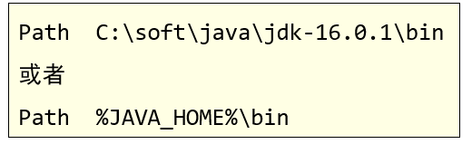

### 5.3、部分 win10 的 bug

当电脑重启之后，环境变量失效了。表示操作系统不支持自定义的环境变量。

解决方案：

- 还是要配置 JAVA_HOME 给以后的相关软件去使用

- 可以把 java 和 javac 的完整路径配置到 PATH 当中。比如 E:\develop\JDK\bin

## 6、Notepad++

> 由于 Notepad++ 作者的一些不当言论，不推荐使用 Notepad++ 了，可以选择其他编辑器如 VScode、Sublime、Notepad-- 等

### 6.1、下载与安装

打开百度，搜索一下 notepad++ 就可以了。

安装时傻瓜式安装，直接点击下一步就可以了。

对安装路径有两个小建议：

- 路径不要有中文，不要有空格，不要有一些特殊符号
- 建议最好把所有的跟开发相关的软件都放在一起，方便管理。

### 6.2、设置

右键点击 java 文件，选择 edit with notepad++。

安装完毕后，为了之后使用方便，做一个简单的配置：修改默认语言和编码

点击设置，再点击首选项。在弹出的页面当中，左侧选择新建，中间选择 Java，右侧选择 ANSI，表示使用本地默认编码。

## 7、Java 语言的发展

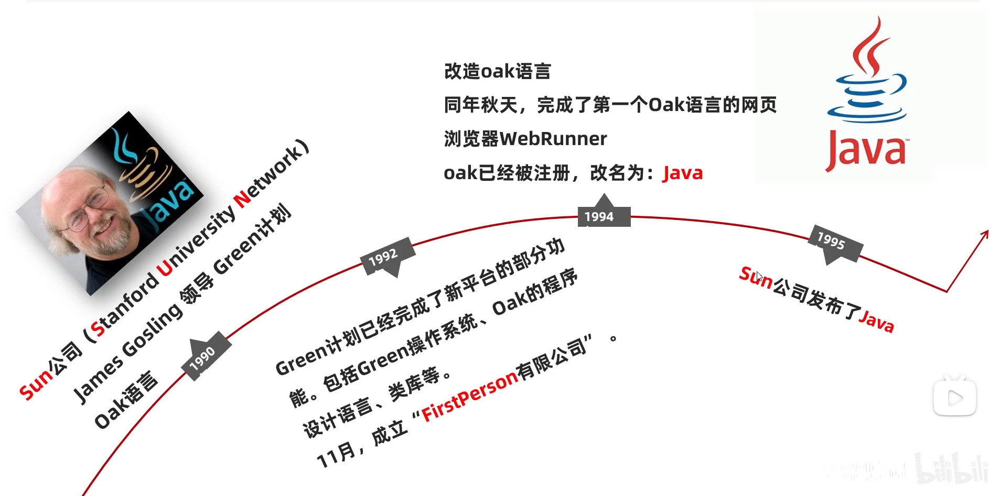

三个重要版本：

* Java 5.0：这是 Java 的第一个大版本更新。
* Java 8.0：这个是目前绝大数公司正在使用的版本。因为这个版本最为稳定。
* Java 17.0：这个是我们课程中学习的版本。

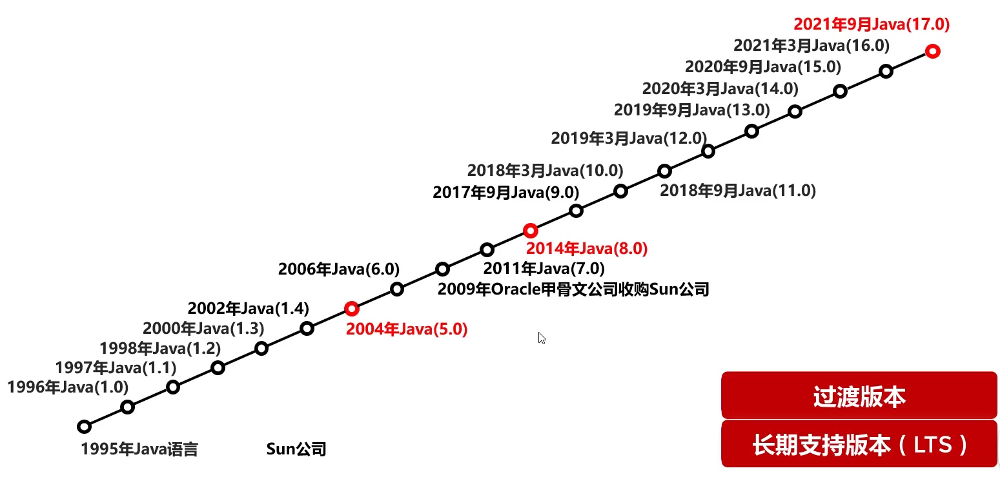

解惑：

我们学的跟工作中使用的版本不太一样啊。会不会影响以后工作呢？

向下兼容。新的版本只是在原有的基础上添加了一些新的功能而已。

举例：

* 用 8 版本开发的代码，用 11 版本能运行吗？必须可以的。
* 用 11 版本开发的代码，用 8 版本能运行吗？不一定。
  * 如果 11 版本开发的代码，没有用到 9~11 的新特性，那么用 8 是可以运行的。
  * 如果 11 版本开发的代码，用到了 9~11 的新特性，那么用 8 就无法运行了。


## 8、Java 的三大平台

### 8.1、JavaSE

Java 语言的标准版，用于桌面应用的开发，是其他两个版本的基础。

* 桌面应用：用户只要打开程序，程序的界面会让用户在最短的时间内找到他们需要的功能，同时主动带领用户完成他们的工作并得到最好的体验。如电脑上的计算器

### 8.2、JavaME

Java 语言的小型版，用于嵌入式消费类电子设备或者小型移动设备的开发。

其中最为主要的还是小型移动设备的开发（手机）。但已渐渐的没落了，已经被安卓和IOS给替代了。

但是，安卓也是可以用 Java 来开发的。

### 8.3、JavaEE

Java 语言的企业版，用于 Web 方向的网站开发（主要从事后台服务器的开发）

在服务器领域，Java 是当之无愧的龙头老大。

> Java 的应用场景：
>
> 1. 桌面应用开发：各种税务管理软件，IDEA，Clion，Pycharm
> 2. 企业级应用开发：微服务，SpringCloud
> 3. 移动应用开发：鸿蒙，Android，医疗设备
> 4. 科学计算：matlab 是用 Java 开发的
> 5. 大数据开发：hadoop 是用 Java 开发的
> 6. 游戏开发：如我的世界 MineCraft

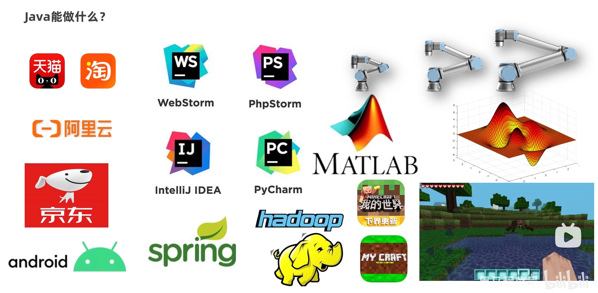

## 9、Java的主要特性

- 面向对象
- 安全性
- 多线程
- 简单易用
- 开源
- 跨平台：Java 程序可以在任意操作系统上运行

### Java 语言跨平台的原理

高级语言的编译运行方式：

1. 编程：编写代码，如 Java 程序员写的 .java 代码，C 程序员写的 .c 代码，Python 程序员写的 .py 代码
2. 编译：机器只认识 0011 的机器语言，把 .java、.c、.py 的代码做转化让机器认识的过程
3. 运行：让机器执行编译后的指令

高级语言的三种编译方式：

* 编译型

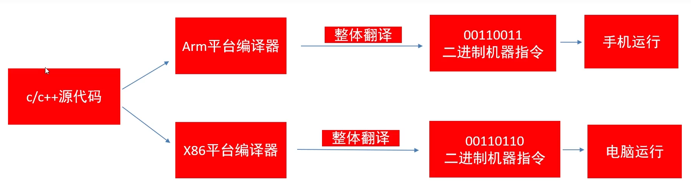


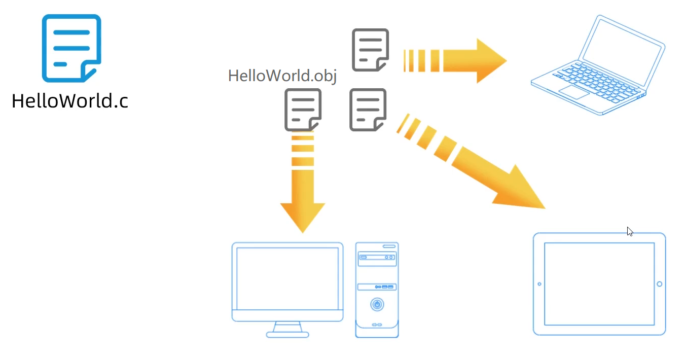

* 解释型

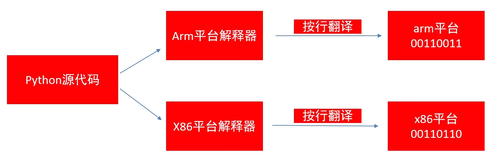


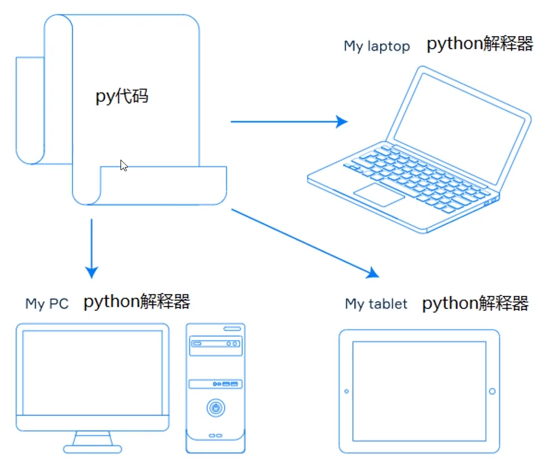

* 混合型，半编译半解释

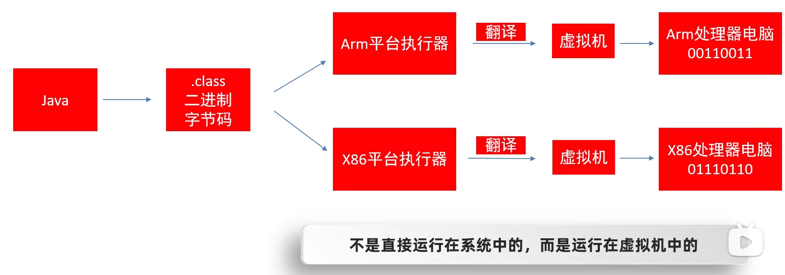


Java 语言的跨平台是通过虚拟机实现的。

操作系统本身其实是不认识 Java 语言的。Java语言不是直接运行在操作系统里面的，而是运行在虚拟机中的。虚拟机会把 Java 语言翻译成操作系统能看得懂的语言。

针对于不同的操作系统，Java 提供了不同的虚拟机。


## 10、JRE 和 JDK

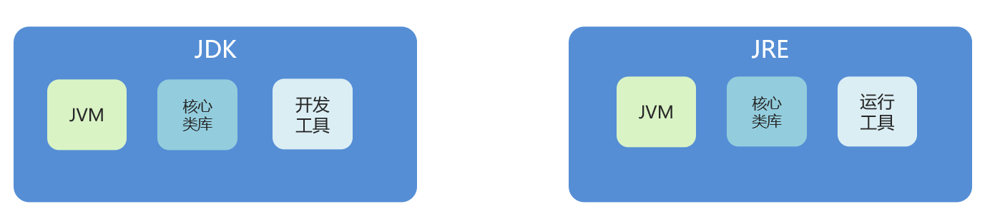

* JVM（Java Virtual Machine），Java 虚拟机，真正运行 Java 程序的地方

* JRE（Java Runtime Environment），Java 运行环境，包含了 JVM 和 Java 的核心类库（Java API）
  * 核心类库：Java 已经写好的东西，我们可以直接用

* JDK（Java Development Kit）：Java 开发工具包，包含了 JRE 和开发工具
  * 开发工具如 javac 编译工具、java 运行工具、jdb 调试工具、jhat 内存分析工具

总结：我们只需安装 JDK 即可，它包含了 Java 的运行环境和虚拟机。

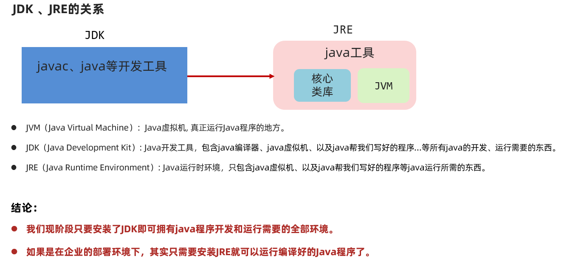
